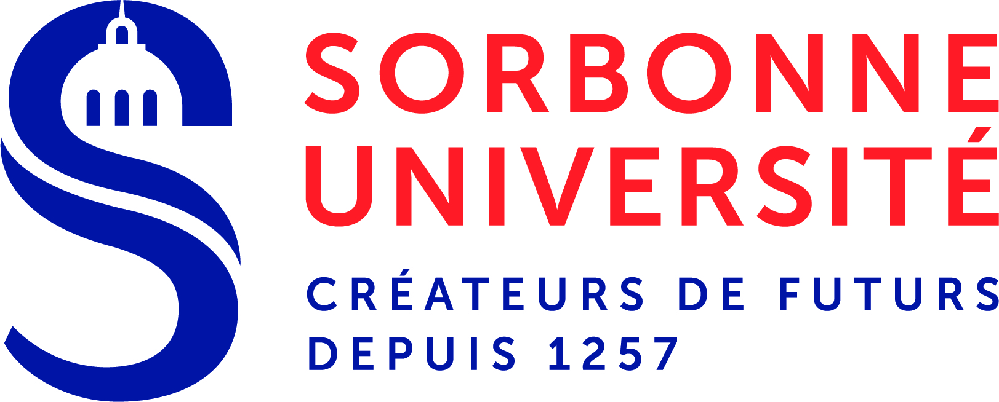

# Dungeon-Master
## Réalisé par :

* Sofiane GHERSA
* Kahina FEKIR

## Problématique
Ce travail consiste à réaliser un jeu de type **Dungeon Master**.
On donne une spécification d’un jeu similaire a Dungeon Master et
d'implémenter cette spécification selon la méthode **Design-byContract**.

## Conception
Nos choix techniques sont :

* L’application est réalisée suivant la méthode **Design-byContract**.
* l’implémentation est écrit en **JAVA**.
* l’interface graphique est développé en **JAVA SWING**.
* la spécification est dans les classes **contracts** .

## Test
Afin de tester les différents services implémentés nous utilisons les commandes
suivantes sur le terminal :

* **Map :** ant runMapTest
* **EditMap :** ant runMapTest
* **Environnement :** ant runEnvironmentTest
* **Mob :** ant runMobTest
* **Cow :** ant runCowTest
* **Player :** ant runPlayerTest
* **Engine :** ant runEngineTest
* **Interface graphique :** Lancer la classe **launch.java**

## Amélioration
Le jeu réalisé pour le moment permet de créer une grille à partir des
fichiers .TXT qui se trouvent dans le package Fille. Il couvrent toutes les contraintes
de base définies, afin de se déplacer et arriver à la sortie tout en respectant les
règles du jeu.
Afin d’améliorer ce dernier nous envisageons ajouter :
* Monstres et Combat.
* Trésor.
* La gestion de grille a partir d’une interface graphique.

## Conclusion
Ce projet est une bonne occasion de mise en pratique des différentes
connaissances acquises dans le cadre de module CPS, nous avons pu développer
un jeu entièrement basé sur la méthode **Design-byContract** qui a été une véritable
découverte pour nous.
Nous avons pu mettre en corrélation les aspects théoriques et pratiques,
sans éclipser les difficultés que nous avons rencontrées dans ce projet notamment la
spécification incomplète, possèdent des incohérences qui nécessite certaines
modifications et adaptations aux besoins et règles du jeu.
Pour Conclure ce projet s’est avéré très enrichissant, En plus de le
respect des délais et le travail en équipe seront des aspects essentiel, nous avons
effectivement acquis de nombreuses connaissances profondes de développement
des composants. Nous avons acquis des compétences nouvelles particulièrement la
décomposition d’un grand projet en composants et la résolutions de chacun
séparément de l’autre.

